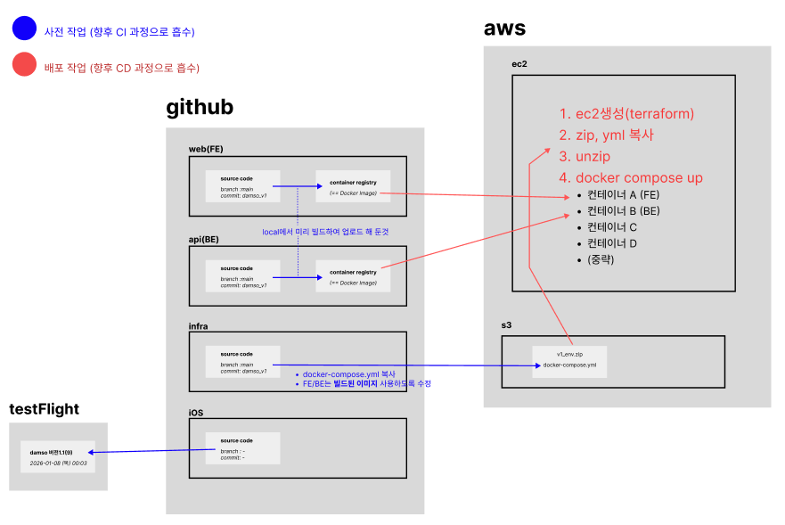

## 개발하려는 제품 설명

- 개인-서버(AI 페르소나) 영상 통화 서비스
- 영상 통화 종합 관제
- AI 활용 영상/음성 분석 및 RAG 파이프라인의 데이터베이스로 활용

## 인프라 아키텍쳐

- 개발 비용(시간, 학습량) 최소화를 위한 설계
- 총 5개의 레포지토리
    - mobile: 모바일 클라이언트
    - FE: 관제 클라이언트
    - BE: livekit 서버 및 범용 api서버
    - AI: RAG 파이프라인
    - infra: 개발서버 및 배포서버 자동화 등


### 개발 서버

- FE/BE팀

    - 안정화 버전 AI 서버로 접속해서 ssh-tunneling(AI 서버 호출용 host)
    - docker-compose 실행
        - 개발하려는 서비스는 로컬 소스코드 bind-mount
        - 여타 서비스들 registry에서 이미지 가져와 컨테이너 실행
        - DB들은 종류 무관 local containers 활용

- AI팀

    - GPU 인스턴스 실행 및 접속
    - 소스코드 pull / 의존성 설치
        - DB 컨테이너 활용 등을 위해 docker-compose로 실행
    - local에서 vs-code 접속용 host 제공


### 안정화 버전 AI 서버

특정 branch (e.g. release) CICD로 build 된 Image 및 local DB containers로 구성된 도커 컴포즈 실행

---

## 배포 환경 (Production v1)

### 📐 아키텍처 개요



**배포 흐름:**

🔵 **CI 단계 (파란색)** - 로컬에서 수동 실행
1. **web(FE)**: 소스코드 빌드 → GHCR에 이미지 푸시 (`ghcr.io/namanmoo-damso/web:v1`)
2. **api(BE)**: 소스코드 빌드 → GHCR에 이미지 푸시 (`ghcr.io/namanmoo-damso/api:v1`)
3. **infra**: docker-compose.yml, env.zip 준비 → S3 업로드 (`s3://sodam-prod-artifacts/prod/v1/`)

🔴 **CD 단계 (빨간색)** - Terraform & user_data 자동화
1. **Terraform**: EC2 인스턴스 생성 (c7i.xlarge)
2. **user_data 스크립트 실행**:
   - S3에서 zip, yml 다운로드
   - 압축 해제
   - `docker compose up` 실행
3. **컨테이너 실행**: 컨테이너 A(FE), B(BE), C, D, 중략 (LiveKit, Caddy, DB, Redis 등)

**단일 서버 docker-compose 배포 방식**
- 1대의 EC2 인스턴스에서 전체 스택 실행
- GHCR에서 빌드된 이미지 pull (public repository)
- S3에서 환경 변수 및 설정 파일 다운로드
- Route53로 자동 DNS 연결 (sodam.store)
- user_data로 완전 자동 배포 (~3분)

### 🏗️ 인프라 구성

**AWS 리소스:**
- **EC2**: c7i.xlarge (4 vCPU, 8GB RAM, 50GB SSD)
- **Route53**: sodam.store A 레코드 (자동 Public IP 연결)
- **S3**: sodam-prod-artifacts/prod/v1/ (배포 아티팩트)
- **IAM**: EC2 인스턴스 프로파일 (S3 읽기 권한)
- **Security Group**: SSH, HTTP, HTTPS, LiveKit 포트

**컨테이너 스택:**
- **LiveKit**: WebRTC 미디어 서버
- **Caddy**: 리버스 프록시 & HTTPS 자동 인증서
- **PostgreSQL 16**: 메인 데이터베이스
- **Redis 7**: 캐시 & 세션 스토어
- **API**: 백엔드 서버 (ghcr.io/namanmoo-damso/api:v1)
- **Web**: Next.js 프론트엔드 (ghcr.io/namanmoo-damso/web:v1)
- **Agent**: AI 음성 에이전트 (ghcr.io/namanmoo-damso/agent:v1)

### 🚀 배포 가이드

#### 1. 사전 준비

**이미지 빌드 및 GHCR 푸시:**
```bash
# docker-compose.build.yml로 이미지 빌드
docker compose -f docker-compose.build.yml build

# GHCR에 푸시
docker push ghcr.io/namanmoo-damso/api:v1
docker push ghcr.io/namanmoo-damso/web:v1
docker push ghcr.io/namanmoo-damso/agent:v1
```

- File Path: docker-compose.build.yml
  ```yaml
  services:
    api:
      build:
        context: ../ops-api
        dockerfile: Dockerfile
      image: ghcr.io/namanmoo-damso/api:v1
  
    agent:
      build:
        context: ../ops-api/agents
        dockerfile: Dockerfile
      image: ghcr.io/namanmoo-damso/agent:v1
  
    web:
      build:
        context: ../ops-web
        dockerfile: Dockerfile
        args:
          # .env 파일에서 값을 읽어와 빌드 인자로 전달
          NEXT_PUBLIC_API_BASE: ${NEXT_PUBLIC_API_BASE}
          NEXT_PUBLIC_API_URL: ${NEXT_PUBLIC_API_URL}
          NEXT_PUBLIC_LIVEKIT_URL: ${NEXT_PUBLIC_LIVEKIT_URL}
          NEXT_PUBLIC_ROOM_NAME: ${NEXT_PUBLIC_ROOM_NAME}
          NEXT_PUBLIC_NAVER_MAP_CLIENT_ID: ${NEXT_PUBLIC_NAVER_MAP_CLIENT_ID}
          NEXT_PUBLIC_KAKAO_CLIENT_ID: ${NEXT_PUBLIC_KAKAO_CLIENT_ID}
          NEXT_PUBLIC_GOOGLE_CLIENT_ID: ${NEXT_PUBLIC_GOOGLE_CLIENT_ID}
      image: ghcr.io/namanmoo-damso/web:v1
  ```

**S3에 배포 아티팩트 업로드:**
```bash
cd terraform/environments/prod/v1/deployment-artifacts

# docker-compose.yml 업로드
aws s3 cp docker-compose.yml s3://sodam-prod-artifacts/prod/v1/docker-compose.yml

# env.zip 업로드 (환경 변수 파일들)
aws s3 cp env.zip s3://sodam-prod-artifacts/prod/v1/env.zip
```

#### 2. Terraform 배포

**Global 리소스 생성 (보안 그룹, IAM):**
```bash
cd terraform/global
terraform init
terraform apply
```

**Production v1 배포:**
```bash
cd terraform/environments/prod/v1
terraform init
terraform apply
```

#### 3. 배포 확인

**Terraform 출력 확인:**
```bash
terraform output
# domain_name = "sodam.store"
# prod_server_public_ip = "xx.xx.xx.xx"
```

**EC2 접속 및 초기화 로그 확인:**
```bash
ssh -i ~/.ssh/dev-server.pem ubuntu@<PUBLIC_IP>

# 초기화 로그 확인 (3-5분 소요)
tail -f ~/initialization.log

# 서비스 상태 확인
cd ~/deploy
docker compose ps
```

**서비스 접속:**
- 브라우저: https://sodam.store (DNS 전파 1-2분 소요)
- API: http://sodam.store:8080 (Caddy를 통한 프록시)

#### 4. 배포 자동화 프로세스

EC2 인스턴스가 시작되면 user_data 스크립트가 자동으로:
1. 시스템 패키지 업데이트
2. Docker & Docker Compose 설치
3. AWS CLI 설치/확인
4. S3에서 env.zip, docker-compose.yml 다운로드
5. 환경 변수 파일 압축 해제
6. GHCR에서 이미지 pull
7. `docker compose up -d` 실행

**초기화 완료 확인:**
```bash
# init 완료 플래그 확인
ls /tmp/init-complete

# 모든 서비스 Up 확인
docker compose ps
# 예상: livekit, caddy, db, redis, api, web, agent 모두 Up
```

### 📋 인프라 정리

**리소스 삭제:**
```bash
cd terraform/environments/prod/v1
terraform destroy

cd terraform/global
terraform destroy
```

**주의사항:**
- EIP를 사용하지 않으므로 인스턴스를 **중지(Stop)하면 IP가 변경**됩니다
- IP 변경 시 Route53가 자동으로 업데이트되지만, **terraform apply로 재배포 필요**
- 인스턴스는 삭제(Terminate)만 권장
